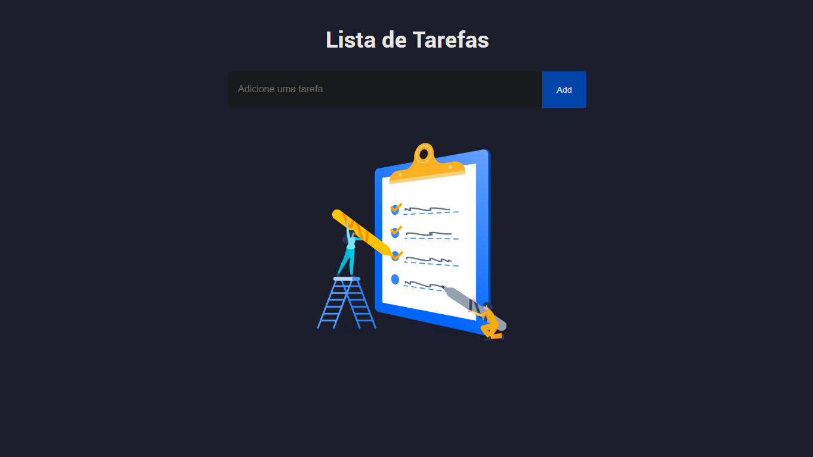
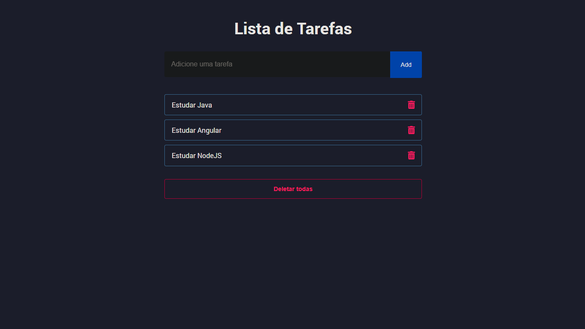

# React - Lista de Tarefas

Este projeto foi desenvolvido para fins de estudo sobre o React.

## Introdução

O projeto se trata de uma aplicação para listar tarefas, onde é possivel acessá-la por meio do navegador. Nela é possivel adicionar novas tarefas, marcar uma tarefa como concluída e excluí-las. No projeto, utilizei Local Storage, sendo assim as alterações feitas são armazenadas localmente no navegador.

### Pré-requisitos

Ao clonar o repositório, é necessário primeiramente baixar as dependências do projeto. Abra um novo terminal no diretório do projeto e digite comando:
```
npm install
```
Para executar o projeto em ambiente de desenvolvimento, basta digitar o seguinte comando no terminal:
```
npm run dev
```

## Tecnologias utilizadas:

* JavaScript
* React JS
* Vite

## Imagem do Projeto


